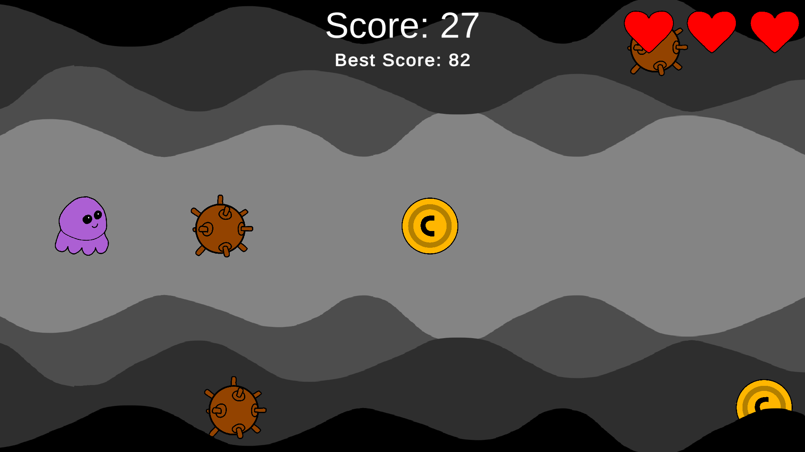

# Infinite Sidescroller Game

This project is a small and not quite finished infinite sidescrolling game of an octopus dodging sea mines.

## The Gameplay

The game is a basic infinitely scrolling game made in Unity with C#. It features a small purple octopus dodging sea mines in a regularly expanding world, collecting coins and hearts as you go.

## Images

## Status and Further Developmet

Unity runs very slowly on my laptop, and I'll probably not continue working on it, but the game needs the following:

* Menu screen
* Options menu
* Audio
* High score tracking
* Navigation tools on end of game loop.
